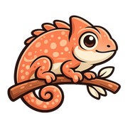

<p align="center">
  
</p>

<h1 align="center">Camouflage — A typeface-matching tool</h1>

A tool for picking the right typeface, in disguise. Tell it what you're
making and it recommends the face that fits; or type into the tester and
preview the whole embedded library at once. The name says it: on the home page
the word *Camouflage* wears a different face on **every single letter**. Every
font is embedded straight from the `/fonts` folder with `@font-face`, so it
looks identical on any machine with nothing to install.

> Answer four questions, or type into the tester — the whole library rewrites
> itself in real time.

---

## ✨ What's inside

A single, self-contained static site — no framework, no runtime dependencies.
Just open `index.html`.

- **Font Matcher** — answer four quick questions about the job and it recommends the face that fits, the way you'd brief a designer about a client.
- **Live type tester** — one input drives every specimen *and* the whole library at once, with a size slider.
- **Disguised wordmark** — the hero spells *Camouflage* with one letter per typeface, and an animated mascot, Camo the chameleon.
- **Featured specimens** — a hand-curated set, each with its own description, tags, and character set.
- **The full library** — every embedded face on one wall, fonts loaded progressively so the page stays fast.
- **Self-hosted & offline** — all fonts embedded locally; responsive, keyboard-friendly, reduced-motion aware.

---

## 🔤 The collection

| # | Typeface | File | Style | Format |
|---|----------|------|-------|--------|
| 01 | **Asgerion** | `fonts/asgerion.otf` | Display · Fantasy | OTF |
|    | Asgerion Line | `fonts/asgerion-line.otf` | Display (outline cut) | OTF |
|    | Asgerion Solid | `fonts/asgerion-solid.otf` | Display (solid cut) | OTF |
| 02 | **Steak Muroh** | `fonts/steak-muroh.ttf` | Display · Heavy | TTF |
| 03 | **Wonderful Combination** | `fonts/wonderful-combination.otf` | Script · Signature | OTF |
| 04 | **Kids Brush** | `fonts/kids-brush.ttf` | Brush · Handwriting | TTF |
| 05 | **Millwee Manuscripting** | `fonts/millwee-manuscripting.ttf` | Script · Handwriting | TTF |
| 06 | **Get Schwifty** | `fonts/get-schwifty.ttf` | Display · Cartoon | TTF |
| 07 | **Wubba Lubba Dub Dub** | `fonts/wubba-lubba-dub-dub.ttf` | Display · Cartoon | TTF |
| 08 | **Rouletta** | `fonts/rouletta.ttf` | Script · Monoline | TTF |
| 09 | **Adobe Garamond** | `fonts/adobe-garamond-bold.ttf` | Serif · Classic (Bold) | TTF |
| 10 | **ITC Tiffany** | `fonts/itc-tiffany-medium.otf` | Serif · Fashion | OTF |
|    | ITC Tiffany Light | `fonts/itc-tiffany-light.otf` | Serif (light cut) | OTF |
|    | ITC Tiffany Demi Italic | `fonts/itc-tiffany-demi-italic.otf` | Serif (italic cut) | OTF |
|    | ITC Tiffany Heavy | `fonts/tiffany-heavy-condensed.ttf` | Serif (heavy condensed) | TTF |
| 11 | **Care Bear Family** | `fonts/care-bear-family.ttf` | Display · Cute | TTF |
| 12 | **Complete** | `fonts/complete-plain.ttf` | Display · Heavy | TTF |

---

## 🎯 Font Matcher

Not sure which face suits a project? The **Font Matcher** section asks four
questions — what you're making, the personality, the formality, and the energy —
then scores every typeface against your answers and recommends the best fit
(plus a couple of runners-up). The "what are you making" answer is weighted
highest, because the job is the strongest signal. All of the matching logic
lives in `app.js` (the `QUIZ` array and each font's `match` keywords), so it's
easy to tune.

---

## 🚀 Run it locally

Because the fonts are loaded over `@font-face`, open the page through a tiny
local server (opening the file directly with `file://` can block font loading in
some browsers).

```bash
# Python 3 (already on most machines)
python3 -m http.server 8000

# …then visit http://localhost:8000
```

Any static server works just as well (`npx serve`, the VS Code Live Server
extension, etc.).

### Deploy to GitHub Pages

1. Push this folder to a GitHub repository.
2. **Settings → Pages → Build and deployment → Source: Deploy from a branch.**
3. Pick your branch and the `/ (root)` folder, then save.

The site is plain HTML/CSS/JS, so it works on Pages, Netlify, Vercel, or any
static host with zero configuration.

---

## 🛠 Using a font in your own project

Grab the file you want from `/fonts` and embed it:

```css
@font-face {
  font-family: "Steak Muroh";
  src: url("./fonts/steak-muroh.ttf") format("truetype");
  font-display: swap;
}

h1 {
  font-family: "Steak Muroh", sans-serif;
}
```

For design tools (Figma, Affinity, the Adobe apps, Word…), just double-click the
font file to install it on your system.

---

## 📁 Project structure

```
camouflage/
├── index.html          # The page
├── styles.css          # Theme, layout, specimens, matcher, motion
├── app.js              # Specimen data + live tester + Font Matcher
├── mascot.png          # "Camo" the chameleon mascot (source)
├── mascot-web.png      # background removed, used on the site
├── mascot.svg          # earlier vector mascot (unused)
├── README.md
└── fonts/
    ├── fonts.css       # @font-face declarations
    ├── asgerion.otf
    ├── asgerion-line.otf
    ├── asgerion-solid.otf
    ├── steak-muroh.ttf
    ├── wonderful-combination.otf
    ├── kids-brush.ttf
    ├── millwee-manuscripting.ttf
    ├── get-schwifty.ttf
    ├── wubba-lubba-dub-dub.ttf
    ├── rouletta.ttf
    ├── adobe-garamond-bold.ttf
    ├── itc-tiffany-light.otf
    ├── itc-tiffany-medium.otf
    ├── itc-tiffany-demi-italic.otf
    ├── tiffany-heavy-condensed.ttf
    ├── care-bear-family.ttf
    └── complete-plain.ttf
```

> Files were renamed from their original download names (e.g.
> `SteakMurohRegular-3z7yX.ttf` → `steak-muroh.ttf`) to clean, readable,
> kebab-case names.

---

## 🧩 Built by stacking skills

Camouflage wasn't built by one prompt. It was assembled by **composing several
Claude Code skills**, each handling a different altitude of the work. Skills are
reusable packets of expertise you invoke with a slash command (`/impeccable`,
`/beautiful-type`); several can be active in the same session, and they layer
rather than fight — because each one owns a different scope.

The build used four:

| Skill | Scope | What it did here |
|---|---|---|
| **`impeccable`** | The whole interface — layout, color, motion, hierarchy, responsiveness | Shaped the dark gallery, the sticky tester, the section rhythm, the reveal animations |
| **`beautiful-type`** | Typography only — font choice, pairing, scale, `@font-face`, micro-typography | Drove the embedding, the disguised wordmark, the type scale, and the matcher's brief→face logic. *(This skill was generated **from** this project.)* |
| **`hue`** | Meta — *generates* new design-language skills | Could spin Camouflage's look into a reusable brand skill of its own |
| **`cadence`** | Prose voice — makes writing sound human, in a chosen tone | Wrote the *"Your face matters"* essay in a philosopher's register, scored 0 on its de-slop detector |

### How to combine them yourself

Think in **altitudes**, and go broad → narrow:

1. **Set the identity** — if you have a brand look, capture it as a skill with
   `/hue` first, so every later step inherits it.
2. **Build the interface** — `/impeccable craft <page>` for structure, layout,
   color, and motion. This is the generalist; it scaffolds the whole thing.
3. **Refine one dimension** — invoke a specialist on the result. `/beautiful-type`
   tunes the type system; another skill could own color, or copy.
4. **Fill the words** — `/cadence write <brief>` for any real prose so it doesn't
   read as AI filler.

They don't conflict because they don't overlap: `impeccable` works at the
whole-page level and *defers* the deep type decisions to `beautiful-type`, which
in turn leaves layout and color alone. A generalist sets the stage; a specialist
sweats one detail. Stack as many as the job has distinct layers — just keep each
to its own scope and run them broad-first.

> Want the Camouflage look as a one-command skill? Run `/hue` and point it at this
> site; it'll generate a design-language skill you can `/invoke` on any new page.

---

## 📜 Licensing

This repository contains the **site code** plus a personal collection of fonts
gathered from free-font sites. **The typefaces are the property of their
respective designers and foundries.**

- **Site code (HTML/CSS/JS) © 2026 [wuisabel-gif](https://github.com/wuisabel-gif).** Free to reuse and adapt.
- **Each font keeps its own license.** Several of these were distributed as
  *free for personal use* — **verify the individual license before any
  commercial use**, and credit the original designer where required.

If you are a font's author and would like a credit added or a file removed,
please open an issue.

---

<sub>© 2026 <a href="https://github.com/wuisabel-gif">wuisabel-gif</a> · curated &amp; embedded with care.</sub>
